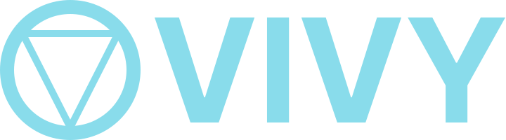
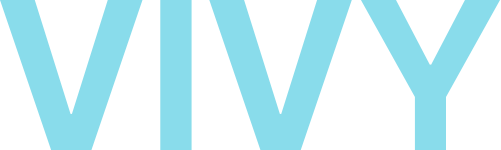

<h3 align="center">Branding Assets</h3>

---

This repository contains all of VIVY's branding assets.

## Logos

These logos are the primary branding for VIVY. They use Catppuccin's Sky color (see [colors](#colors)). No other form of
this icon and wordmark is valid.

### Icon

> Based on the icons that identify AI from the anime Vivy: Fluorite Eye's Song. Outer circle is 20 pixels thick, inner
> triangle is 10 pixels thick.

### Wordmark

> Modified Inter Bold.

### Full Logo

> A combination of the icon and wordmark, with 20 pixels of padding.

## Colors

VIVY uses the [Catppuccin](https://github.com/catppuccin/catppuccin) color palette. We also follow Catppuccin's
[style guide](https://github.com/catppuccin/catppuccin/blob/main/docs/style-guide.md). In light theme, the site and
branding uses the Latte palette, whilst in dark theme it uses the Mocha palette. All coloring is done with the Mocha
palette _first_, then restyled with the Latte palette. Since the palettes are designed to be easily swapped between,
this shouldn't cause too many issues, however colors may be changed for Latte. Despite this, color changing should be
avoided where possible and only done if there's an accessibility concern.

VIVY's accent color is  Sky, which changes depending on your theme. If theme autodetection is
not possible (e.g., open graph), then  Mocha Sky is used.
